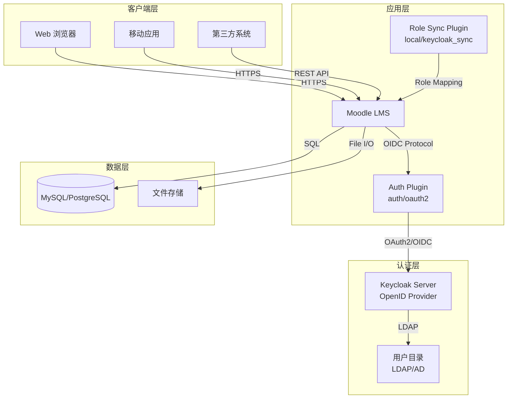

<div align="center">


# 🎓 Moodle Learning Management System

[](https://php.net)
[](https://www.mysql.com/)
[](https://www.gnu.org/licenses/gpl-3.0)
[](#single-sign-on-sso)

**企业级开源学习管理平台 | OpenID Connect 单点登录集成 | Keycloak 角色自动映射**

</div>

---

## 📋 目录

- [🚀 项目概览](#-项目概览)
- [✨ 核心特性](#-核心特性)
- [🆕 新增功能：Keycloak 角色映射](#-新增功能keycloak-角色映射)
- [🏗️ 系统架构](#️-系统架构)
- [🔐 单点登录 (SSO)](#-单点登录-sso)
- [📦 技术栈](#-技术栈)
- [🛠️ 快速部署](#️-快速部署)
- [⚙️ 配置说明](#️-配置说明)
- [🔧 高级功能](#-高级功能)
- [📊 系统监控](#-系统监控)
- [🤝 贡献指南](#-贡献指南)
- [📄 许可证](#-许可证)

---

## 🚀 项目概览

本项目是基于 **Moodle 4.x** 构建的企业级学习管理系统 (LMS)，深度集成了 **Keycloak** 身份认证平台，实现了完整的 **OpenID Connect (OIDC)** 单点登录解决方案，并支持 **Keycloak 角色自动映射到 Moodle 权限**。

### 🎯 设计目标

- **安全性**：企业级身份认证与授权
- **自动化**：Keycloak 角色自动映射到 Moodle
- **可扩展性**：模块化架构，易于功能扩展
- **标准化**：遵循 OpenID Connect 协议标准
- **用户体验**：无缝的单点登录体验

---

## ✨ 核心特性

### 🔐 身份认证
- ✅ **OpenID Connect (OIDC)** 协议支持
- ✅ **Keycloak** 企业级身份认证集成
- ✅ 单点登录 (SSO) 与单点登出 (SLO)
- ✅ JWT Token 安全传输
- ✅ 自动用户同步与属性映射

### 👥 用户管理
- ✅ **Keycloak 角色自动映射**到 Moodle 角色
- ✅ 基于角色的访问控制 (RBAC)
- ✅ 细粒度权限管理
- ✅ 用户组与组织架构同步
- ✅ 批量用户导入/导出

### 📚 学习管理
- ✅ 课程创建与管理
- ✅ 作业与测验系统
- ✅ 成绩簿与进度追踪
- ✅ 活动报告与分析

### 🔌 扩展集成
- ✅ RESTful API 接口
- ✅ WebService 支持
- ✅ 插件化架构
- ✅ 第三方系统对接

---

## 🆕 新增功能：Keycloak 角色映射

### 功能概述

本项目新增了 **Keycloak 角色自动映射**功能，可以将 Keycloak 中的角色自动同步到 Moodle 的用户角色，实现统一的身份权限管理。

### 角色映射规则

| Keycloak 角色 | Moodle 角色 | 权限说明 |
|--------------|-------------|----------|
| `moodle-admin` | `manager` | 站点管理员，拥有所有管理权限 |
| `moodle-teacher` | `editingteacher` | 教师，可以编辑课程内容和评分 |
| `moodle-student` | `student` | 学生，参与课程学习 |

### 工作流程

```
用户登录 Keycloak → 返回包含角色的 Token → Moodle 解析 Token → 
自动分配对应角色 → 用户获得相应权限
```

### 配置步骤

1. **在 Keycloak 中创建角色**
   - 进入 Realm Roles
   - 创建 `moodle-admin`, `moodle-teacher`, `moodle-student`

2. **配置客户端作用域**
   - 创建 `moodle-roles` 客户端作用域
   - 添加 "User Realm Role" Mapper
   - 将作用域分配给 Moodle 客户端

3. **为用户分配角色**
   - 在 Keycloak 中为用户分配相应角色

4. **Moodle 自动处理**
   - 用户登录时自动获取角色
   - 自动分配 Moodle 角色
   - 支持课程自动注册

### 详细文档

📖 **[Keycloak 角色映射配置指南](./KEYCLOAK_ROLE_MAPPING_GUIDE.md)**

---

## 🏗️ 系统架构



---

## 🔐 单点登录 (SSO)

### Keycloak 集成

本系统实现了与 **Keycloak** 的深度集成，提供企业级单点登录解决方案。

#### 集成亮点

| 特性 | 描述 | 状态 |
|------|------|------|
| **OIDC 标准协议** | 完整的 OpenID Connect 认证流程 | ✅ 已实现 |
| **自动用户同步** | 登录时自动创建/更新 Moodle 用户 | ✅ 已实现 |
| **角色映射** | Keycloak 角色自动映射到 Moodle 权限 | ✅ 已实现 |
| **单点登出** | 支持全系统统一登出 (SLO) | ✅ 已实现 |
| **属性映射** | 支持 email、姓名等属性自动映射 | ✅ 已实现 |

#### 身份认证流程

```
┌─────────────┐                    ┌──────────────┐                    ┌─────────────┐
│   用户      │                    │   Moodle     │                    │  Keycloak   │
│  (浏览器)   │                    │   (SP)       │                    │   (IdP)     │
└──────┬──────┘                    └──────┬───────┘                    └──────┬──────┘
       │                                  │                                   │
       │  1. 访问 Moodle                  │                                   │
       │ ────────────────────────────────▶│                                   │
       │                                  │                                   │
       │  2. 重定向到 Keycloak 登录页     │                                   │
       │ ◀────────────────────────────────│                                   │
       │                                  │  3. OIDC 授权请求                 │
       │                                  │ ────────────────────────────────▶│
       │                                  │                                   │
       │  4. 用户登录认证                 │                                   │
       │ ───────────────────────────────────────────────────────────────────▶│
       │                                  │                                   │
       │                                  │  5. 返回 Authorization Code       │
       │                                  │ ◀────────────────────────────────│
       │                                  │                                   │
       │  6. 携带 Code 返回 Moodle        │                                   │
       │ ────────────────────────────────▶│                                   │
       │                                  │  7. 用 Code 换取 Token            │
       │                                  │ ────────────────────────────────▶│
       │                                  │                                   │
       │                                  │  8. 返回 ID Token + Access Token  │
       │                                  │ ◀────────────────────────────────│
       │                                  │                                   │
       │  9. 解析用户信息，完成登录       │                                   │
       │ ◀────────────────────────────────│                                   │
       │                                  │                                   │
```

#### 详细文档

📖 **[Moodle & Keycloak 集成详细文档](./KEYCLOAK_INTEGRATION_DETAILS.md)**

本文档包含：
- 🔧 **完整配置指南** - 服务端与客户端配置步骤
- 🔗 **OAuth2 端点** - Authorization/Token/Userinfo/Logout URL
- 👤 **用户属性映射** - username、email、name 字段对应关系
- 🎭 **角色映射策略** - Keycloak 角色到 Moodle 角色的转换规则
- 🚪 **单点登出 (SLO)** - 全系统登出实现细节
- 📝 **自动课程注册** - 基于 Token 声明的自动选课
- 🐛 **故障排除** - 常见问题与解决方案
- 💾 **数据库配置** - 相关表结构与配置项

---

## 📦 技术栈

### 后端技术

| 技术 | 版本 | 用途 |
|------|------|------|
| **PHP** | 8.0+ | 核心开发语言 |
| **MySQL/PostgreSQL** | 5.7+ / 12+ | 关系型数据库 |
| **Moodle** | 4.x | 学习管理框架 |
| **Keycloak** | 20+ | 身份认证与授权 |

### 前端技术

| 技术 | 版本 | 用途 |
|------|------|------|
| **YUI** | 3.x | 传统 UI 组件 |
| **AMD JavaScript** | ES6+ | 模块化 JavaScript |
| **Mustache** | - | 模板引擎 |
| **SCSS** | - | 样式预处理 |

### 协议与标准

| 标准 | 说明 |
|------|------|
| **OpenID Connect** | 身份认证协议 |
| **OAuth 2.0** | 授权框架 |
| **JWT** | JSON Web Token |
| **REST API** | WebService 接口 |
| **SCORM** | 在线课程内容标准 |
| **LTI** | 学习工具互操作 |

---

## 🛠️ 快速部署

### 环境要求

- **Web 服务器**：Apache 2.4+ / Nginx 1.18+
- **PHP**：8.0+ (推荐 8.1)
- **数据库**：MySQL 5.7+ 或 PostgreSQL 12+
- **Keycloak**：20+ (独立部署)

### 安装步骤

```bash
# 1. 克隆仓库
git clone https://github.com/RENsir03/Moodle.git
cd Moodle

# 2. 配置数据库
mysql -u root -p -e "CREATE DATABASE moodle DEFAULT CHARACTER SET utf8mb4;"

# 3. 配置 Web 服务器
# 将项目目录指向 /var/www/html/moodle

# 4. 设置权限
chmod -R 755 /var/www/html/moodle
chown -R www-data:www-data /var/www/html/moodle

# 5. 访问安装向导
# 浏览器访问 http://your-server/moodle
```

### Keycloak 配置

```bash
# 1. 启动 Keycloak (Docker)
docker run -p 8080:8080 \
  -e KEYCLOAK_ADMIN=admin \
  -e KEYCLOAK_ADMIN_PASSWORD=admin \
  quay.io/keycloak/keycloak:20.0.0 \
  start-dev

# 2. 创建 Realm 和 Client
# 访问 http://localhost:8080/admin

# 3. 配置角色映射
# 运行自动配置脚本
./keycloak_role_config.sh

# 4. 配置详细步骤见文档
# ./KEYCLOAK_INTEGRATION_DETAILS.md
# ./KEYCLOAK_ROLE_MAPPING_GUIDE.md
```

---

## ⚙️ 配置说明

### 核心配置文件

| 文件路径 | 说明 |
|---------|------|
| `config.php` | Moodle 主配置文件 |
| `auth/oauth2/classes/auth.php` | OAuth2 认证插件（已添加角色映射钩子） |
| `local/keycloak_sync/settings.php` | Keycloak 角色同步插件配置 |

### 关键配置项

```php
// config.php - 数据库配置
$CFG->dbtype    = 'mysqli';
$CFG->dblibrary = 'native';
$CFG->dbhost    = 'localhost';
$CFG->dbname    = 'moodle';
$CFG->dbuser    = 'moodle';
$CFG->dbpass    = 'your-password';

// Keycloak 端点配置
$CFG->keycloak_baseurl = 'http://10.70.5.223:8080/realms/master';
$CFG->keycloak_clientid = 'moodle-realm';
$CFG->keycloak_clientsecret = 'your-client-secret';
```

### 角色映射配置

在 Moodle 管理后台：
**Site Administration** → **Plugins** → **Local plugins** → **Keycloak Role and Enrollment Sync**

配置项：
- **Admin Role Claim**: `moodle-admin`
- **Teacher Role Claim**: `moodle-teacher`
- **Student Role Claim**: `moodle-student`
- **Enable Debug Logging**: ✅ (开发环境启用)

---

## 🔧 高级功能

### 自定义角色映射插件

项目包含自定义开发的 `local_keycloak_sync` 插件，实现 Keycloak 角色到 Moodle 的自动映射：

- **自动角色分配** - 基于 Keycloak 角色自动分配 Moodle 权限
- **课程自动注册** - 教师自动注册到指定类别课程
- **事件监听** - 响应 Moodle 用户登录/创建事件
- **调试日志** - 详细的角色映射过程日志
- **多种角色来源** - 支持 realm_access、resource_access、groups 等多种角色声明格式

### 代码修改说明

**修改的文件**：`auth/oauth2/classes/auth.php`

在 `complete_login` 方法中添加了角色处理钩子：

```php
// Hook for Keycloak role synchronization.
// This allows local_keycloak_sync plugin to process Keycloak roles before login completes.
if (class_exists('local_keycloak_sync\auth_hook')) {
    \local_keycloak_sync\auth_hook::process_keycloak_userinfo(
        json_decode(json_encode($rawuserinfo), true)
    );
}
```

---

## 📊 系统监控

### 日志位置

| 日志类型 | 路径 |
|---------|------|
| **Moodle 日志** | `moodledata/debug.log` |
| **Web 服务器** | `/var/log/apache2/error.log` |
| **Keycloak** | `keycloak/standalone/log/` |

### 监控指标

- 用户登录成功率
- SSO 认证响应时间
- 角色映射成功率
- 数据库查询性能
- 系统资源使用率

---

## 🤝 贡献指南

我们欢迎社区贡献！请遵循以下步骤：

1. **Fork** 本仓库
2. 创建 **Feature Branch** (`git checkout -b feature/amazing-feature`)
3. **Commit** 更改 (`git commit -m 'Add amazing feature'`)
4. **Push** 到分支 (`git push origin feature/amazing-feature`)
5. 创建 **Pull Request**

### 代码规范

- 遵循 [Moodle 编码规范](https://moodledev.io/general/development/policies/codingstyle)
- PHP 代码必须通过 `moodle-plugin-ci` 检查
- 提交信息使用英文，清晰描述更改内容

---

## 📄 许可证

本项目基于 [GNU General Public License v3.0](https://www.gnu.org/licenses/gpl-3.0) 开源许可证。

Moodle 是 [Moodle Pty Ltd](https://moodle.com/) 的注册商标。

---

<div align="center">

**[⬆ 返回顶部](#-moodle-learning-management-system)**

Made with ❤️ by the Moodle Community

</div>
